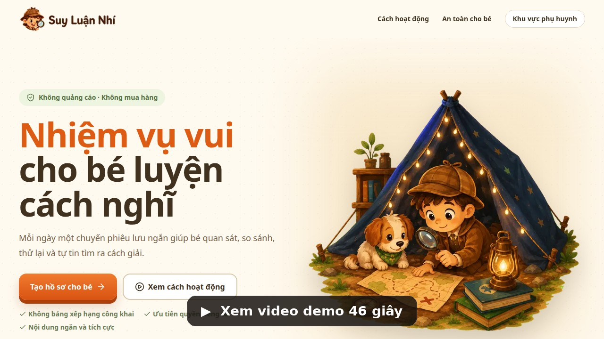

# Suy Luận Nhí — Production Application

Ứng dụng nhiệm vụ suy luận an toàn cho trẻ, gồm Child App, Parent Workspace và Content Operations CMS. Hệ thống dùng PostgreSQL thật, Better Auth, immutable content versions, transactional Mission Sessions và media storage có lớp kiểm duyệt.

## Demo nhanh

[](docs/assets/demo/suy-luan-nhi-demo.mp4)

Video 46 giây đi qua luồng chính: trang giới thiệu → đăng nhập phụ huynh → chọn hồ sơ bé → bản đồ và trải nghiệm nhiệm vụ → khu vực phụ huynh → quản trị nội dung.

## Công nghệ

- Next.js App Router, React, TypeScript, Tailwind CSS
- PostgreSQL 17 và Drizzle ORM migrations
- Better Auth email/password, session, reset password và email verification
- Zod, React Hook Form và TanStack Query
- Local filesystem adapter cho development; S3-compatible storage cho production
- Vitest, PostgreSQL integration tests và Playwright E2E
- Docker, health checks và GitHub Actions CI

## Khởi động local

```bash
cp .env.example .env.local
npm install
npm run db:bootstrap
npm run dev
```

Dịch vụ development:

- Web: `http://localhost:3000`
- PostgreSQL: `localhost:54329`
- Mailpit UI: `http://localhost:8025`

Tài khoản seed local, cùng mật khẩu `LocalDemo-2026!`:

| Email                 | Role          |
| --------------------- | ------------- |
| `parent@demo.local`   | Parent        |
| `content@demo.local`  | Content Admin |
| `reviewer@demo.local` | Reviewer      |
| `admin@demo.local`    | Super Admin   |

Các tài khoản này chỉ dành cho local/test. Không chạy seed demo trong production.

## Chức năng chính

### Child App

- Privacy-minimal Child Profile CRUD và chọn active profile bằng HttpOnly cookie
- Mission Map theo tuổi, thứ tự và unlock rules
- 12 mission mẫu, 24 câu hỏi và 5 loại gameplay
- Hint nhiều cấp, retry tích cực, resume/exit và replay rules
- Transactional progress, badges, activity summaries và notifications
- Idempotent answer/completion APIs, unique active-session index

### Parent Workspace

- Parent Gate bằng phép tính hoặc scrypt PIN, lockout khi thử sai nhiều lần
- Dashboard tuần, lịch sử có bộ lọc, badges và Thinking Habits
- Conversation suggestions và parent resources
- Notification center
- Sound/effects/privacy/notification settings
- Reset progress, data export download và deletion request workflow

### Content Operations

- Mission CRUD, ordering, duplicate và archive
- Editor hỗ trợ single choice, pattern, drag/drop, fill answer và sorting
- Preview dùng cùng Child Renderer với gameplay
- Safety Checklist và media approval
- Immutable version submit → reviewer approve/reject → publish/schedule
- Mission Worlds, age groups, skills, badges, members/roles
- Media library cho image/audio, local hoặc S3
- Reports, audit log, system settings và data request processing

## Route quan trọng

```text
/auth/sign-in
/profiles
/missions
/play/:sessionId
/complete/:sessionId
/parent
/parent/activity
/parent/suggestions
/parent/resources
/parent/settings
/admin
/admin/missions
/admin/reviews
/admin/media
/admin/worlds
/admin/taxonomy
/admin/members
/admin/reports
/admin/audit
/admin/data-requests
```

## Database

```bash
npm run infra:up
npm run db:generate
npm run db:migrate
npm run db:seed
npm run db:studio
```

Migrations nằm trong `drizzle/`. Production deploy phải chạy `npm run db:migrate` trước khi đưa image mới vào traffic.

## Quality gates

```bash
npm run format:check
npm run lint
npm run typecheck
npm run test
npm run test:integration
npm run build
npm run test:e2e
npm run verify
```

- Unit/component tests chạy không cần DB test fixture.
- Integration test chạy trên PostgreSQL thật và kiểm tra resume, idempotency, completion exactly-once, activity và notification.
- E2E dùng bốn tài khoản seed để kiểm tra Child, Parent và review/publish workflow.

## Production deployment

- Environment template: `.env.production.example`
- Self-hosted Compose: `docker-compose.production.yml`
- Runbook: `docs/operations/production-runbook.md`
- Threat model: `docs/security/threat-model.md`
- API overview: `docs/api/README.md`
- Liveness: `/api/health/live`
- Readiness: `/api/health/ready`

Production phải dùng secret manager, TLS, SMTP thật, S3-compatible storage và backup PostgreSQL đã kiểm thử restore. Scheduled publishing gọi `POST /api/cron/publish-scheduled` với Bearer `CRON_SECRET`.

## Kiến trúc và workflow agent

- Domain context: `CONTEXT.md`
- ADRs: `docs/adr/`
- Production specification: `.scratch/sln-production/spec.md`
- Implementation tickets: `.scratch/sln-production/issues/`
- Matt Pocock skills: `.agents/skills/mattpocock/`
- Review artifacts: `_bmad-output/implementation-artifacts/reviews/`
